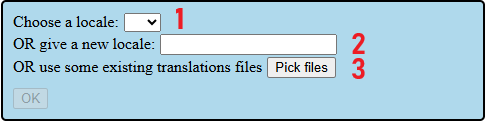
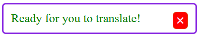

 

# Localisation Tool

This tool is designed to ease the creation or the update of localisation files used by Strype. \
For more details about how Strype deals with the localisation files as such, please check [this documentation](https://github.com/k-pet-group/Strype/tree/main/docs/translation).

The following guide explains how to use this tool.

## Purpose of the tool

Strype relies on translations files to be displayed in different locales.
These files are JSON files that Strype parse to retrieve the translations for some given keys.\
Therefore, when Strype is updated, the translations files can become outdated and seeing what to change from a previous version of the files can be daunting.

We have designed this tool **to help translators to**
- see which translations are missing in an existing translations file (for a given locale already supported by Strype),
- start off writing translations for a new locale not supported by Strype yet.

>[!IMPORTANT]
>The output of the tool is the translations files for the current locale the translators are working on.

For more details about how Strype handles the translations files, please consult [this documentation](https://github.com/k-pet-group/Strype/tree/main/docs/translation).

> [!CAUTION]
> Translators must bear in mind that their changes __will NOT be saved__ when the tool is closed. \
> Before leaving the tool, always [generate the output files](#generate-the-translations-files) to save changes. \
> These changes can later be [loaded in the tool](#locale-selection) in another session. 

## Manual

### Access to the tool
This tool is accessible online [here](https://strype.org/localisation-tool/).

When the page loads, the tool attempts to retrieve some information against the Strype's GitHub repository.\
Progress is shown in the status information box. Translators can continue towards the next step when the status box shows this status:\

### Locale selection
The locale can be selected inside the locale selection box once the tool is ready (see previous section).

Options are:\

- 1: selecting a locale already supported by Strype,
- 2: typing a new locale that Strype does not support yet (as a two-letter language code, different from the existing locales available in option 1),
- 3: getting the locale and the translations from existing files, the files' name and content must comply with the convention used by Strype for the translations file.

>[!TIP]
>Option 3 is useful when you need to load work in progress from the files.\
When clicking on the "Pick files" button, the locale selection box will be replaced by a file uploader. \
__The locale will be detected in the first file upload's name__. \
Translators can upload files for the translation target group they want. \
Confirmation of the uploads will trigger the tool to proceed with the actions described below, but the uploaded file content will be used in the translations. \
Therefore, it the responsability of the translators to __make sure their uploaded files' content will not overwrite translations already in Strype that could have been recently updated by someone else__.

When a locale is selected with option 1, the tool will retrieve the translations from the Strype GitHub repository and show progress in the status box.

For all options, the tool is ready to show the translations (in the [translations display box](#translations-tree-area-3)) when the status box displays the following message:\

>[!TIP]
>The tool is taking care of providing empty translation strings for all the missing translations from the English reference to the current locale.\
>See next section for more details on how to see these "missing translations".

### Understanding the translations display interface
The translations display interface (or box) is the main part of the tool. It shows all the localisable content Strype requires and the associated translation strings in the current locale. \
Missing _and_ existing translations show in this box.

#### Layout breakdown

The translations display box contains 3 specific areas: \

>[!IMPORTANT]
>As described in [our translation guide](https://github.com/k-pet-group/Strype/tree/main/docs/translation), translations are organised as a tree (nested structure). That is, some translation _key_ can contain other translation keys.\
This is a critical point to understand for using the tool.

##### Controls (area 1)
This area hosts several controls to display the translations:
- the list of the translation groups available - a translation group is a set of translations; whenever a translation group is set, the corresponding translations are displayed in [the translations tree area](#translations-tree-area-3),
- the "Only show (new) entries that are not translated" checkbox - acts as a filter: when checked, only the translations that are empty (or node of translations that contain any empty child) show in [the translations tree area](#translations-tree-area-3),
- the "Generate translation files" button (see [related section](#generate-the-translations-files)).

>[!TIP]
>This filter is particularly useful when translators only want to work on missing translations.

##### Translation input  (area 2)
This area shows the original (English) string to translate for a given translation key (selected in [the translations tree](#translations-tree-area-3)) and, if available, the **editable** translation string for the current locale. \
Translation strings are empty when they did not exist in the current locale yet.

>[!WARNING]
>The tool does _not_ require the translators to validate their translation every time they make a change on a translation string. \
>Any change made on a translation string will be saved by the tool (as long as the tool remains open), and will be included in the output files.

>[!CAUTION]
>As explained in [the translation guide](https://github.com/k-pet-group/Strype/tree/main/docs/translation), some translations need to preserve `\n`. \
>To spot this in a translation, `\n` will appear in the English and translated strings as `⏎`. \
>**Please use** `⏎` **in your translation** (you can copy it from the English version and paste it in the translated string). The tool will convert it back to `\n` during file generation.

When a translation node contains other translation nodes, no translation can be inserted: \

#### Translations tree (area 3)
This area displays the translations tree - each tree node is selectable (see [how](#interaction)).
The translation node currently selected is indicated by an arrow and a blue background like this: \

A translation node containing other translation node is indicated by a [+] or [-] like this: \

A colour scheme on the translation nodes is in place to help translators identified missing translations:
- a red background indicates an empty translation,
- an orange background indicates a translation node containing *at least one* missing translation node.

#### Interaction
Interacting with the [translation tree](#translations-tree-area-3) can be done with
- the mouse: clicking on a translation node selects it, clicking on the expand/collapse indicator shows/hides deeper translation nodes),
- the keyboard.

>[!TIP]
>When using the keyboard, translators can navigate the tree __even when they are in the [translation string input](#translation-input--area-2)__. \
>See the details below: 

These keys are used for interaction:
- ↓ and ↑: select the next/previous translation node of the translation tree,
- → and ←: expand/collapse a translation node that contains other translation node - if the current node is a translation node without children (i.e. a node that expects a translation string), these keys will select the next/previous translation node instead  and they will __not__ be effective in the translation string input (to allow moving the text caret in the input...)
- ⇟ (page down) and ⇞ (page up): scroll down/up the translation tree (_not effective in the translation string input_)
- ⤓ (end) and ⤒ (home): jump to the bottom/top of the translation tree (_not effective in the translation string input_)

### Generate the translations files
When ready to generate the translations files, click on the "Generate translations files" button at the top of the [translations display box](#controls-area-1).

The translations display box and the status box will temporarily hide to make place for the file generation box as shown below:\

The checkbox "Keep translations whose key no longer exists in English" is __not checked__ by default.
>[!CAUTION]
>Translators are advised to keep it unchecked unless they really want to keep the "orphan translations" in the output files. \
>Orphan translations are ignored by Strype, so by default, they are not included in the generated files.

A file will be generated for each translation group selected in the above box. Note that at least one target group must be selected.\
The files will be generated with the naming convention expected by Strype (e.g. "fr_main.json").\
*Any empty translation (that is, a translation set to an empty string or a translation key containing only empty translations) will be discarded.*

>[!NOTE]
>When translators want the translations to be added to Strype, they can send us the files or create a merge request in the Strype project's main branch.\
See [this documentation](https://github.com/k-pet-group/Strype/tree/main/docs/translation) for more details.
